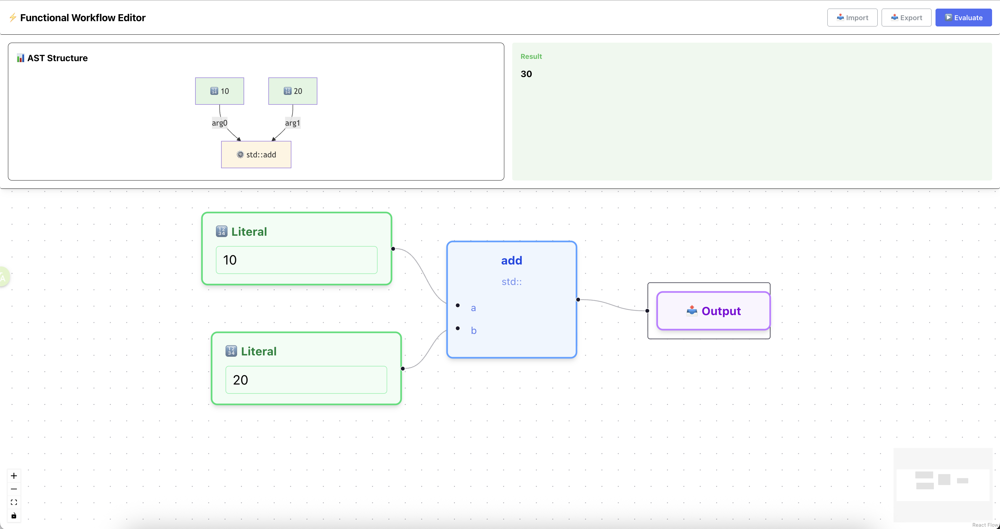
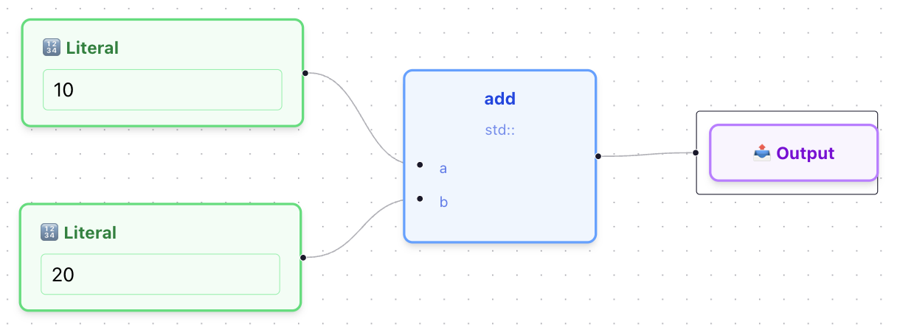
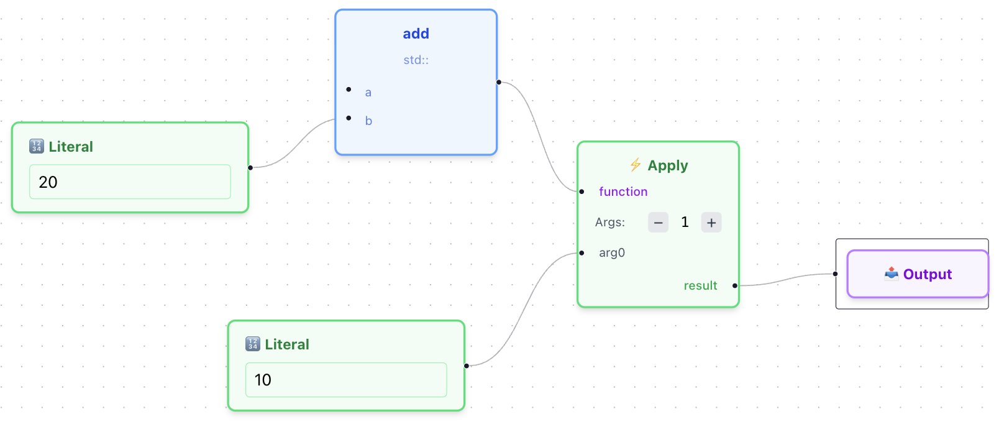
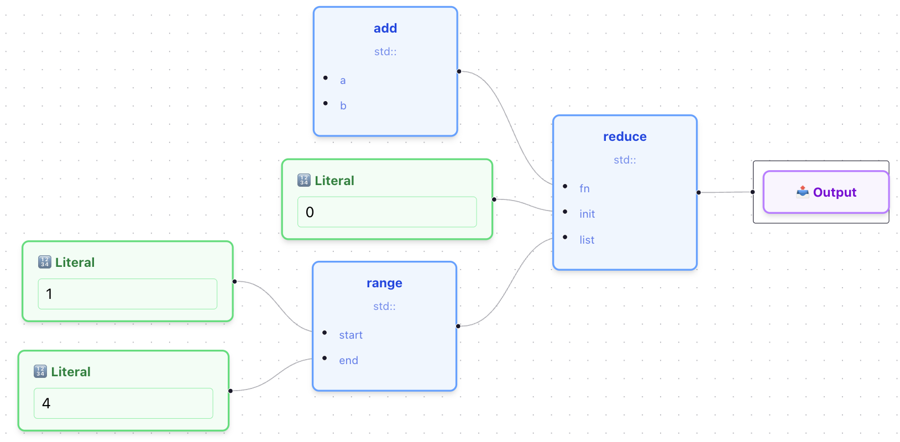

***This Readme is deprecated.***


**文档目标**：大致理解法术系统运作，可以添加新的库函数以及迁移到新的平台

使用（TODO）标记的部分为暂未实现

已部署至Github Pages，可以从[这里](https://shiratsuyudachi.github.io/SpellCompiler-web/)访问

# 基本概念

- 法术系统分为前端和后端
- **前端（本仓库）**：使用Reactflow实现的web工作流编辑器，输出json格式的法术程序给后端执行
- **后端**：包括一个解释器和对应的Library，可以接受上述json，并实际运行法术
  - 后端可以有多个实现，前端自带`JS/浏览器`后端，游戏端的实现称为`C#/Unity`后端
- 这个以json存储的法术程序被称为**抽象法术树**（Abstract Spell Tree, AST），是一个类似抽象语法树的树形结构
  - 考虑传统解释型语言的架构：`代码 → Lexer → Parser → AST(抽象语法树) → IR(中间表示) → 解释器执行`
  - 本项目中的AST(抽象法术树)位于**IR层级**，类似于Java字节码或LLVM IR，会直接被解释器执行
  - 除非专门标注，在下文及本项目中，**AST均指抽象法术树**

# 前端



- 使用Web前端技术栈基于React编写，工作流编辑部分使用Reactflow库实现
- Reactflow提供了一个画布，用户可以在其中创建/编辑节点和节点之间的连接，形成一个图（Graph，图论中由节点和边定义的数据结构）
  - **节点**：每个节点表示一个函数调用
  - **边**：连接节点的边表示数据流向
    - 由于支持一等函数特性，函数本身也可以作为数据在节点间传递
- 前端的 **"编译功能"**：将画布上的图结构转换为解释器可执行的AST，交给后端执行
  - 具体实现在 `src/utils/flowToIR.ts

## UI介绍

- 画布主区域右键打开菜单，选择Add Node即可打开节点列表，点击想要的节点就可以创建
- 节点的旁边的黑点称为handle，拖动handle可以拉出一条线连接其他handle
- 点击页面右上方的Evaluate后，画布中的图就会先被编译为AST，然后交给`JS/浏览器`后端运行
- 运行后即可可以看到上方的AST Structure以及右侧的Result
	- AST Structure为编译后的AST可视化
	- Result会展示Output节点的输入

# 后端

**整体思路**：法术即函数，纯粹的函数式编程

- 没有传统运算符，加减乘除等都是库函数
- 一等函数 + 闭包 + 递归 → 实现所有控制流
- 列表通过 Lisp 风格函数实现（cons/head/tail）
- **架构优势**：求值器(Evaluator)即完整解释器，无需额外模块

## AST

AST定义在 `src/ast/ast.ts`，只有5种节点类型，核心思想是**一切皆为函数**。

**AST节点类型**：

1. **Literal**：字面量（数字、字符串、布尔值）
2. **Identifier**：标识符（引用参数或函数）
3. **FunctionCall**：函数调用
4. **IfExpression**：条件表达式
5. **Lambda**：匿名函数

**AST示例**：

计算 `3 + 5`：

```json
{
	"type": "FunctionCall",
	"function": "std::add",
	"args": [
		{"type": "Literal", "value": 3},
		{"type": "Literal", "value": 5}
	]
}
```

条件表达式 `if (x > 0) then x else -x`（绝对值）：

```json
{
	"type": "IfExpression",
	"condition": {
		"type": "FunctionCall",
		"function": "std::gt",
		"args": [
			{"type": "Identifier", "name": "x"},
			{"type": "Literal", "value": 0}
		]
	},
	"thenBranch": {"type": "Identifier", "name": "x"},
	"elseBranch": {
		"type": "FunctionCall",
		"function": "std::negate",
		"args": [{"type": "Identifier", "name": "x"}]
	}
}
```

Lambda表达式 `(x) => x * 2`：

```json
{
	"type": "Lambda",
	"params": ["x"],
	"body": {
		"type": "FunctionCall",
		"function": "std::multiply",
		"args": [
			{"type": "Identifier", "name": "x"},
			{"type": "Literal", "value": 2}
		]
	}
}
```

## 运行环境

如同Python等脚本语言可以在不同平台上执行，本项目的AST也支持多平台执行：

- **已实现**：
  - C#/Unity环境（游戏本体）
  - JS/浏览器环境（用于测试基础功能）
- **计划中**：Java/Minecraft环境（TODO）

**实现要求**：任意平台只需实现解释器和标准库，即可运行相同的法术程序

**JS/浏览器实现位置**：

- 解释器：`src/ast/evaluator.ts`
- 标准库：`src/ast/library.ts`

## 解释器与Library

**Library（库函数）**：

- **标准库（std::前缀）**：定义基本操作的函数

  - 算术：`add`, `subtract`, `multiply`, `divide`
  - 比较：`gt`, `lt`, `eq`
  - 逻辑：`and`, `or`, `not`
  - 列表：`list`, `cons`, `head`, `tail`, `map`, `filter`, `reduce`
  - 所有后端都应实现标准库
- **扩展库（平台前缀）**：各后端独有的功能

  - Unity后端（`sc::前缀`）：`sc::teleport`, `sc::createBullet`等游戏交互函数
  - 浏览器后端（`browser::前缀`）：`browser::print`等控制台函数（TODO）
  - Minecraft后端（`mc::前缀`）：`mc::placeblock`等（TODO）

**解释器**：

- 作用：根据输入的AST结构，递归执行各个节点，调用对应的库函数
- 全局函数表：所有函数（标准库+扩展库+用户自定义）都注册在全局函数表中
- 用户自定义函数：玩家可以定义工具函数并注册到全局函数表（TODO实现方式待定）
- 所有解释器实现都支持以下函数式特性

## 函数式特性

### 一等函数（First-Class Functions）

函数可以作为值传递、返回和存储。

**示例**：将函数作为参数传递

```json
{
	"type": "FunctionCall",
	"function": "std::map",
	"args": [
		{
			"type": "Lambda",
			"params": ["x"],
			"body": {
				"type": "FunctionCall",
				"function": "std::multiply",
				"args": [
					{"type": "Identifier", "name": "x"},
					{"type": "Literal", "value": 2}
				]
			}
		},
		{
			"type": "FunctionCall",
			"function": "std::range",
			"args": [
				{"type": "Literal", "value": 1},
				{"type": "Literal", "value": 5}
			]
		}
	]
}
```

这段代码等价于 `map((x) => x * 2, range(1, 5))`，结果为 `[2, 4, 6, 8, 10]`

### 闭包（Closures）

Lambda可以捕获外部环境的变量。

**实现原理**：

- 每个`FunctionValue`包含`capturedEnv`字段，存储创建时的环境
- 当Lambda被创建时，会捕获当前环境的所有变量
- 执行时在捕获的环境基础上添加新参数

**示例**：创建一个"加法器工厂"

```typescript
// 伪代码表示概念
function makeAdder(n) {
	return (x) => x + n;  // 内部lambda捕获了外部的n
}

const add5 = makeAdder(5);
add5(3);  // 返回 8
```

**对应的AST**：

`makeAdder` 函数的定义（函数体是一个返回 Lambda 的表达式）：

```json
{
	"name": "makeAdder",
	"params": ["n"],
	"body": {
		"type": "Lambda",
		"params": ["x"],
		"body": {
			"type": "FunctionCall",
			"function": "std::add",
			"args": [
				{"type": "Identifier", "name": "x"},
				{"type": "Identifier", "name": "n"}
			]
		}
	}
}
```

调用 `makeAdder(5)` 返回一个新的 Lambda，其 `capturedEnv` 包含 `{n: 5}`：

```json
{
	"type": "FunctionCall",
	"function": "makeAdder",
	"args": [
		{"type": "Literal", "value": 5}
	]
}
```

这个调用会返回一个 `FunctionValue`（参见AST定义）：

```typescript
{
	type: 'function',
	definition: {
		name: '<lambda>',
		params: ['x'],
		body: { /* std::add(x, n) 的 AST */ }
	},
	capturedEnv: Map { 'n' => 5 }  // 捕获了 n=5
}
```

之后调用这个返回的函数：`add5(3)` → 相当于 `3 + 5` → 返回 `8`

在AST中，内部lambda的`capturedEnv`会包含 `{n: 5}`，因此即使离开了`makeAdder`的作用域，仍可以访问`n`。

### 柯里化（Currying）

支持部分应用（Partial Application），提供少于要求数量的参数时，会返回一个新函数。

```typescript
// 伪代码，展示柯里化概念
// std::add 期望2个参数
std::add(3, 5)     // 返回 8
std::add(3)        // 返回一个新函数 (y) => 3 + y

const add3 = std::add(3);
add3(5);           // 返回 8
add3(10);          // 返回 13
```

**实现原理**：

- 检测参数数量不足时，创建一个新的`FunctionValue`
- 新函数的`capturedEnv`包含已提供的参数
- 剩余参数列表减少

**前端可视化编辑中的柯里化**：

在前端编辑时，所有函数节点自动支持柯里化：

- **无参数** → 返回函数自身的引用（FunctionValue）
- **部分参数** → 返回特化版本的函数
- **完整参数** → 正常执行并返回结果

**可视化示例**：

**情况1：完整参数（正常调用）**



`add(20, 10)` → 输出 `30`

---

**情况2：部分应用（柯里化）**



等价于 `add(20)(10)` → 输出 `30`

`add(20)` 先返回一个新函数，再传入 `10` 完成计算。

---

**情况3：无参数（函数作为值）**



等价于 `reduce(add, 0, range(1, 4))` → 输出 `10`

`add` 节点不连接参数时，直接作为函数值传递给 `reduce`。

**注意**：`range(1, 4)` 返回 `[1, 2, 3, 4]`，求和结果是 `1+2+3+4 = 10`

### Lambda表达式（匿名函数）

Lambda是一等值，可以在任何需要函数的地方使用。

**语法**：

```json
{
	"type": "Lambda",
	"params": ["参数1", "参数2", ...],
	"body": <任意AST表达式>
}
```

**使用场景**：

- 作为高阶函数的参数（`map`, `filter`, `reduce`）
- 定义局部辅助函数
- 实现递归（通过`std::this`）

**递归Lambda示例**（阶乘）：

```json
{
	"type": "Lambda",
	"params": ["n"],
	"body": {
		"type": "IfExpression",
		"condition": {
			"type": "FunctionCall",
			"function": "std::lte",
			"args": [
				{"type": "Identifier", "name": "n"},
				{"type": "Literal", "value": 1}
			]
		},
		"thenBranch": {"type": "Literal", "value": 1},
		"elseBranch": {
			"type": "FunctionCall",
			"function": "std::multiply",
			"args": [
				{"type": "Identifier", "name": "n"},
				{
					"type": "FunctionCall",
					"function": "std::this",
					"args": [{
						"type": "FunctionCall",
						"function": "std::subtract",
						"args": [
							{"type": "Identifier", "name": "n"},
							{"type": "Literal", "value": 1}
						]
					}]
				}
			]
		}
	}
}
```

`std::this`引用当前函数自身，实现递归调用。

### 列表（函数式实现）

列表通过Lisp风格的函数实现，而非内建数据结构。

**核心函数**：

- `cons(head, tail)`：在列表前添加元素
- `head(list)`：获取第一个元素
- `tail(list)`：获取除第一个外的所有元素
- `empty()`：创建空列表

**示例 - 手动构造列表 `[1, 2, 3]`**：

```typescript
cons(1, cons(2, cons(3, empty())))
```

**示例 - 递归求和**：

```typescript
function sum(list) {
	if (length(list) == 0) {
		return 0;
	} else {
		return head(list) + sum(tail(list));
	}
}
```

**高阶列表函数**：

- `map(fn, list)`：对每个元素应用函数
- `filter(fn, list)`：过滤符合条件的元素
- `reduce(fn, init, list)`：累积计算
- `length(list)`：获取列表长度
- `nth(list, index)`：获取指定位置元素

## 语法糖

### std::this - 递归调用

`std::this` 是一个特殊标识符，用于在函数内部引用当前函数自身，实现递归。

**适用场景**：

- 命名函数的递归
- Lambda表达式的递归（否则匿名函数无法引用自己）

**示例 - 斐波那契数列**：

```json
{
	"type": "Lambda",
	"params": ["n"],
	"body": {
		"type": "IfExpression",
		"condition": {
			"type": "FunctionCall",
			"function": "std::lt",
			"args": [
				{"type": "Identifier", "name": "n"},
				{"type": "Literal", "value": 2}
			]
		},
		"thenBranch": {"type": "Identifier", "name": "n"},
		"elseBranch": {
			"type": "FunctionCall",
			"function": "std::add",
			"args": [
				{
					"type": "FunctionCall",
					"function": "std::this",
					"args": [{
						"type": "FunctionCall",
						"function": "std::subtract",
						"args": [
							{"type": "Identifier", "name": "n"},
							{"type": "Literal", "value": 1}
						]
					}]
				},
				{
					"type": "FunctionCall",
					"function": "std::this",
					"args": [{
						"type": "FunctionCall",
						"function": "std::subtract",
						"args": [
							{"type": "Identifier", "name": "n"},
							{"type": "Literal", "value": 2}
						]
					}]
				}
			]
		}
	}
}
```

等价于：

```typescript
(n) => n < 2 ? n : this(n-1) + this(n-2)
```

### 函数名字符串语法糖

`FunctionCall`的`function`字段可以直接使用字符串表示函数名，无需写完整的`Identifier`节点。

```json
// 简化写法
{
	"type": "FunctionCall",
	"function": "std::add",
	"args": [...]
}

// 完整写法（等价）
{
	"type": "FunctionCall",
	"function": {"type": "Identifier", "name": "std::add"},
	"args": [...]
}
```

这使得常见的函数调用更加简洁。

# 未来计划（TODO）

## 类型系统

**目标**：为AST添加静态类型检查，在运行前发现类型错误。

**阶段一 - 简单类型系统**：

- 只检查函数的输入类型和输出类型是否匹配
- 对于高阶函数，只要求参数是函数即可，不递归检查函数参数的参数类型
- 例如：`map`要求第一个参数是函数，第二个是列表，但不检查函数的具体签名

**阶段二 - 完整类型系统**：

- 支持泛型和类型推导
- 递归检查高阶函数的类型
- 例如：`map<T, U>(fn: (T) => U, list: T[]) => U[]`

## 自定义类型/数据结构

**目标**：支持用户定义复合数据类型。

**应用场景**：

- Unity后端：定义"实体"（Entity）类型，包含位置、生命值等属性
- 通用：向量（Vector）、坐标（Position）等

## 其他计划

- 用户自定义函数的持久化与复用
- 调试工具（断点、单步执行）
- 执行过程可视化
